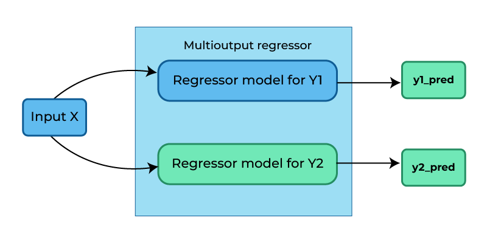
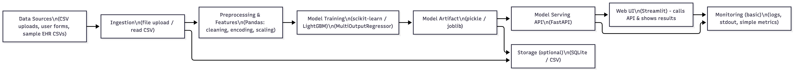

# Health Risk Predictor from Lifestyle & Medical History
<div align="center">


</div>

---

## Live Demo
https://healthriskpredictionapp.streamlit.app/

---

## Table of Contents
1. [Overview](#overview)
2. [Features](#features)
3. [Tech Stack](#tech-stack)
4. [How It Works](#how-it-works)
5. [Model Details & Results](#model-details--results)
   - [Evaluation Metrics (Per Model)](#evaluation-metrics-per-model)
   - [Final (Tuned LightGBM) Cross-Validation Scores](#final-tuned-lightgbm-cross-validation-scores)
6. [Project Structure](#project-structure)
7. [Installation](#installation)
8. [Usage](#usage)
9. [Screenshots & Visuals](#screenshots--visuals)
10. [Future Improvements](#future-improvements)
11. [Contributing](#contributing)
12. [License](#license)
13. [Contact](#contact)

---

## Overview
The Health Risk Predictor is a machine-learning–powered application that analyzes an individual’s lifestyle, medical history, and vital health parameters to predict their risk of developing chronic diseases such as diabetes, hypertension, heart disease, obesity, and cholesterol imbalance — using only tabular data.

The app converts raw medical and lifestyle inputs into personalized risk scores, visual explanations (SHAP), and actionable recommendations that empower users to improve their health early. Early detection and behavior change are critical: studies show a large portion of chronic disease burden can be reduced through preventive measures. This system brings AI-driven preventive healthcare directly to individuals, clinics, and wellness platforms.

---

## Features
- Multi-disease risk prediction (probability 0–100%) for:
  - Diabetes
  - Hypertension
  - Heart disease
  - Obesity
  - Cholesterol imbalance
- Models used: RandomForest, LightGBM, XGBoost (LightGBM selected as best after tuning)
- Processes and analyzes lifestyle & medical inputs including:
  - Age, gender, BMI
  - Sleep, exercise, stress
  - Smoking and alcohol habits
  - Blood pressure, glucose, lipid panel
  - Family history
- Interactive Streamlit dashboard with:
  - Risk radar chart and summary
  - SHAP explanation charts for interpretability
  - User-friendly input forms and modern UI components
- MultiOutputRegressor pipeline to produce five simultaneous risk outputs

---

## Tech Stack
- Python 3.10+
- pandas, numpy
- scikit-learn
- XGBoost, LightGBM
- SHAP
- matplotlib, seaborn
- FastAPI (for API / backend if deployed)
- Joblib (model serialization)

Model training workflow used RandomForest, LightGBM and XGBoost. After hyperparameter tuning, LightGBM produced the best cross-validated results and is shipped as the primary model.

---

## How It Works
1. Data ingestion: user-provided tabular inputs (form fields) or batch CSV.
2. Preprocessing pipeline:
   - Encode categorical variables
   - Normalize / scale numerical features
   - Feature engineering to derive target-like risk signals where necessary
3. Multi-output modeling:
   - A MultiOutputRegressor wraps the base estimator to predict five risk scores simultaneously.
4. Prediction & explanation:
   - The model outputs five continuous risk scores (0–100).
   - SHAP is used to provide feature-level explanations and visualizations for each risk.




---

## Model Details & Results
**Dataset**: Collected from Kaggle (dataset files stored in `data/raw`). To increase realism and enable multi-output targets, additional derived targets were engineered from existing features and Gaussian noise was added to simulate real-world variability. See the `docs/` folder for detailed notes (`why add noise.docx`, `data_create.py`, `Risk_Score_Explanation.docx`).

**Models trained**: RandomForest, LightGBM, XGBoost. MultiOutputRegressor was used to produce five simultaneous outputs.

### Evaluation Metrics (Per Model)
All metrics reported per target: MAE, RMSE, R2.

**1) Random Forest**
- diabetes_risk_score -> MAE: 2.419, RMSE: 3.039, R2: 0.924
- hypertension_risk_score -> MAE: 2.882, RMSE: 3.670, R2: 0.917
- heart_disease_risk_score -> MAE: 3.858, RMSE: 4.855, R2: 0.901
- obesity_risk_score -> MAE: 2.136, RMSE: 2.749, R2: 0.938
- cholesterol_risk_score -> MAE: 1.817, RMSE: 2.460, R2: 0.965
- Mean MAE across targets: 2.622

**2) LightGBM (before final tuning)**
- diabetes_risk_score -> MAE: 1.664, RMSE: 2.083, R2: 0.964
- hypertension_risk_score -> MAE: 2.043, RMSE: 2.563, R2: 0.959
- heart_disease_risk_score -> MAE: 3.227, RMSE: 4.101, R2: 0.929
- obesity_risk_score -> MAE: 1.234, RMSE: 1.547, R2: 0.980
- cholesterol_risk_score -> MAE: 0.823, RMSE: 1.030, R2: 0.994
- Mean MAE across targets: 1.798

**3) XGBoost**
- diabetes_risk_score -> MAE: 1.667, RMSE: 2.089, R2: 0.964
- hypertension_risk_score -> MAE: 2.031, RMSE: 2.551, R2: 0.960
- heart_disease_risk_score -> MAE: 3.237, RMSE: 4.109, R2: 0.929
- obesity_risk_score -> MAE: 1.233, RMSE: 1.546, R2: 0.980
- cholesterol_risk_score -> MAE: 0.832, RMSE: 1.044, R2: 0.994
- Mean MAE across targets: 1.800

### Final (Tuned LightGBM) Cross-Validation Scores
Reported at the best CV index after hyperparameter tuning of LightGBM:
- MAE : 1.7921319405772682
- RMSE: 2.2580921096584015
- R2  : 0.9656208074926215

These are the scores used to justify shipping the tuned LightGBM as `lightgbm_risk_model.pkl` (stored in `models/`).

---

## Project Structure
```
├── app
│   └── app.py
├── Architecture
│   └── Architecture.png
├── data
│   ├── processed
│   │   └── final_data.csv
│   └── raw
│       ├── augmented_risks_with_noise.csv
│       └── Diabetes_and_LifeStyle_Dataset.csv
├── docs
│   ├── data_create.py
│   ├── Risk_Score_Explanation.docx
│   ├── why add noise.docx
│   └── why.docx
├── LICENSE
├── Makefile
├── models
│   ├── best_pipeline.joblib
│   └── lightgbm_risk_model.pkl
├── notebooks
│   ├── data_cleaning_0.ipynb
│   ├── EDA.ipynb
│   └── model_building.ipynb
├── pyproject.toml
├── README.md
├── references
├── reports
│   └── figures
├── requirements.txt
└── runtime.txt
```

---

## Installation
1. Clone the repository:
```bash
git clone <your-repo-url>
cd <your-repo-folder>
```
2. Create and activate a Python environment (recommended):
```bash
python -m venv .venv
# Windows
.\.venv\Scripts\activate
# macOS / Linux
source .venv/bin/activate
```
3. Install dependencies:
```bash
pip install -r requirements.txt
```
4. Model files are provided in `models/`. If you retrain, save the pipeline as `best_pipeline.joblib` and the estimator as `lightgbm_risk_model.pkl`.

---

## Usage
### Run the Streamlit app (local):
```bash
streamlit run app/app.py
```
Open the app at the URL Streamlit prints (typically http://localhost:8501).


---

## Screenshots & Visuals
- Add train vs test graphs (place under `reports/figures/`), and reference them here. Example markdown to add an image:


Include the risk radar chart and representative SHAP plots for interpretability.

---

## Future Improvements (suggested)
- Add user authentication and secure data storage (HIPAA/GDPR considerations where applicable).
- Expand dataset sources and perform external validation on different populations.
- Implement calibrated probability outputs and thresholding for categorical risk bands (low/medium/high).
- Add automated model monitoring, drift detection, and retraining pipeline (CI/CD + MLOps).
- Provide personalized intervention recommendations and integration with clinician workflows.
- Add unit and integration tests for the preprocessing pipeline and model inference.

---

## Contributing
Contributions are welcome. To contribute:
1. Fork the repository.
2. Create a feature branch: `git checkout -b feature/your-feature`.
3. Commit your changes and push: `git push origin feature/your-feature`.
4. Open a pull request describing the changes and any testing performed.

Please include tests for new functionality and follow the existing code style.

---

## License
This project is licensed under the [MIT License](LICENSE).  
You are free to use, modify, and distribute this project with attribution.

---


---

*Notes & References*
- The `docs/` folder contains explanations for why noise was added to derived targets and the methodology used to create multi-output targets. Please read those documents for reproducibility details.
- Model artifacts are stored under `models/` and notebooks used for EDA and model building are under `notebooks/`.

